# BEAR.Sunday Semantic LSP 進捗

最終更新: 2026-09-16

この文書は、BEAR.Sunday 固有セマンティクスを Phpactor Language Server から
IDE と AI の双方へ提供する作業の現在地を示す。実装が進んだら、この図と一覧も更新する。

## 全体像

BEAR 固有の解決規則は LSP handler に置かず、transport-independent な Query 層へ
置く。LSP handler は workspace 相対パスへ正規化する薄い adapter とする。

## フェーズ別の現在地

```mermaid
flowchart TD
    p0["調査・設計\n完了"]
    p1["Workspace 境界と構造化 result\n完了"]
    p2["Resource / Route / SQL / Template / ALPS / Schema Query\n完了"]
    p3["標準 LSP の回帰・stdio 統合テスト\n完了"]
    p4["Headless custom LSP と CLI client\n完了"]
    p5["Resource inventory と outgoing Link / Embed facts\n完了"]
    p6["Incoming Link / Embed と Resource describe 集約\n完了"]
    p7["Project info\n完了"]
    p75["Resource Facts parse cache\n完了"]
    p76["Schema Facts\n完了"]
    p77["ALPS descriptor facts・明示関係\n完了"]
    p78["ALPS / Schema parse cache・freshness\n完了"]
    p79["Resource URI Hover\n完了"]
    p80["ALPS descriptor Hover\n完了"]
    p81["Twig / Qiq Template Hover\n完了"]
    p82["明示 JSON Schema Hover\n完了"]
    p83["Route / SQL Hover\n完了"]
    p84["Inventory index / watcher連携\n完了"]
    p85["Route → Page Resource References\n完了"]
    p86["SQL ID References\n完了"]
    p87["明示 JSON Schema References\n完了"]
    p88["ALPS descriptor属性 References\n完了"]
    p89["Twig / Qiq Template References\n完了"]
    p90["documentSymbol / workspace symbol判断\n完了: 現状は拡張しない"]
    p91["Resource References Query抽出\n完了"]
    p92["Semantic error / provenance / freshness\n完了"]
    p93["URI起点Resource References request\n完了"]
    p94["Custom LSP Semantic API v1契約\n完了"]
    p95["Resource属性facts / inventory\n完了"]
    p96["presence-only contract比較\n完了"]
    p8["別 repository の薄い MCP-LSP adapter\n稼働中・拡張継続"]

    p0 --> p1 --> p2 --> p3 --> p4 --> p5 --> p6 --> p7 --> p75 --> p76 --> p77 --> p78 --> p79 --> p80 --> p81 --> p82 --> p83 --> p84 --> p85 --> p86 --> p87 --> p88 --> p89 --> p90 --> p91 --> p92 --> p93 --> p94 --> p95 --> p96 --> p8
```

## 現在利用できる入口

### 標準 LSP

- `textDocument/definition`: Resource URI、Route、SQL、ALPS、Template、明示 Schema
- `textDocument/typeDefinition`: Resource 規約の response Schema
- `textDocument/references`: Resource、Route、SQL、明示Schema、ALPS descriptor属性、Twig/Qiq Templateの同一セマンティック対象への参照元
- `textDocument/hover`: Resource URI の facts、Route、SQL、ALPS descriptor の fields と明示関係、静的 Template 参照、明示 JSON Schema の構造
- `textDocument/completion`: Resource URI と body Schema property
- `textDocument/documentLink`: Resource URI と Template 参照

Resource URI Hover は Phpactor の単一 Hover handler を置き換えず、その手前の middleware で
認識済み URI だけを処理する。通常の PHP symbol は既存 Phpactor Hover へ委譲するため、拡張の
読込順と Definition locator の優先順位を変更しない。妥当だが未解決の Resource URI は、PHPの
単なる文字列型へフォールバックせず空結果を返す。

ALPS descriptor Hover は `#[Alps('descriptorId')]` の第1引数だけを認識し、同じ
Query 層を通して profile、descriptor fields、同一 profile 内の明示的な `contains`・
ローカル `href`・ローカル `rt` 関係を返す。外部参照を取得せず、名前から Resource
との対応を推測しない。関係は決定的な順序で最大20件ずつ表示し、未解決または
workspace 外の参照は空結果にする。第1引数以外と通常の PHP symbol は Phpactor Hover
へ委譲する。

Template Hover は Definition と同じ静的な Twig `extends` / `include` / `include()` /
`block()` 第2引数、および Qiq `setLayout()` / `render()` / `extends()` を対象にし、engine・
元の名前・workspace相対の解決先を返す。動的式、Twig block名、コメント、文字列のクォート上は
Phpactorへ委譲し、認識済みの静的参照が未解決・不正・workspace外なら空結果にする。Hoverでの
Qiq認識は誤検知を避けるため `qiq` languageId または `var/qiq/template` 配下に限定し、既存
Definitionの互換用heuristicは変更しない。PHPとして開かれたtemplate文書ではALPS、明示Schema、
SQL、Route、Resource URI、Templateの順に判定するため、既存BEAR Hoverを抑制しない。

明示 JSON Schema Hover は BEAR の `#[JsonSchema(...)]` でファイル参照になる第1位置引数・
`schema:`・`params:` だけを認識する。前2つはresponse、`params:` はrequestとして、workspace
相対path、top-level type、名前順で最大20件のproperty・型・required状態を返す。`key:`・
`target:`・第2位置引数・動的式・別FQNの同名属性・文字列のクォート上はPhpactorへ委譲する。
raw JSONや外部`$ref`は読み出さず、認識済み参照が未解決・不正・壊れたJSON・workspace外なら
空結果にする。PHP文書ではALPS、明示Schema、SQL、Route、Resource URI、Templateの順に判定する。

Route Hover は `aura.route.php` の既知 Aura.Router 呼び出しにある静的な第1位置引数または`name:`だけを対象にし、
route名、対応するPage Resource URI・FQN・workspace相対pathを返す。HTTP pathの第2引数、`attach`、
動的式、クォート上はPhpactorへ委譲し、対応Resourceが未解決・曖昧・不正・workspace外なら空結果にする。

Route名からのReferencesは、Definitionと同じRoute QueryでPage Resourceを一意に解決し、同じPage Resourceへ
解決されるRoute宣言とResource URI参照を返す。HTTP pathは対象にせず、未解決・曖昧なRouteからは空結果を返す。
Route fileの走査はworkspace内の`aura.route.php`だけに限定し、入力を1 MiBに制限する。

ResourceのReferences走査は`ResourceReferencesQuery`へ集約した。URI、解決済みResource、workspace相対の
Resource class fileを入口にでき、LSPのPositionやLocationを必要としない。各URI参照は参照元自身のproject
contextから再解決してcanonical target fileを比較するため、mini app間の同名URIを混同しない。PHP sourceと
Route fileはいずれもworkspace境界内だけを読み、1ファイル1 MiBに制限し、結果をfile・byte range順に固定する。
Phpactor adapterにはカーソル位置の識別とLocation変換だけを残している。

SQL Hover は Ray.MediaQuery の `DbQuery` 属性にある第1位置引数または `id:` と、既存のtokenized
docblock形式 `@Query("id")` の静的IDだけを対象にし、query IDとworkspace相対SQL pathを返す。
SQL本文は返さない。`type:`・`factory:`・後続引数・動的式・別FQN属性・クォート上はPhpactorへ委譲し、
認識済みIDが未解決・不正・workspace外なら空結果にする。

同じ静的SQL IDからのReferencesは、実在するSQLファイルへ一意に解決できる場合だけ、PSR-4 source root内の
`DbQuery`とlegacy `@Query`を列挙する。単なる同名文字列、別FQN属性、非ID引数、動的式、SQLファイルが
欠落したIDは参照と見なさない。走査先はcanonical workspace内に制限し、各PHP入力を1 MiBに制限する。
結果はファイルpathとbyte rangeで決定的に整列し、`includeDeclaration: true`なら既存Definitionを通じて
対応SQLファイルも標準LSPの宣言Locationとして得られる。

明示JSON SchemaからのReferencesは、Definition/Hoverと同じ`#[JsonSchema(...)]`の第1位置引数・
`schema:`・`params:`を対象にする。各候補をSchema Queryで解決し、同じcanonical Schemaファイルを
指す属性引数だけを返す。requestとresponse、規約Schema、別FQN属性、非対応引数、動的式、欠落Schemaを
混同しない。SQLとSchemaのPHP走査は共通scannerを使い、workspace内PSR-4 root、1 MiB上限、
canonical pathの重複排除と決定順を共有する。`includeDeclaration: true`では対応Schemaも宣言として返る。

ALPS descriptorからのReferencesは、`#[Alps('descriptorId')]`の静的な第1引数をPHP source root内で列挙する。
単なる同名IDではなく、各利用位置から解決したprofile pathとdescriptor byte offsetが一致するものだけを返すため、
別project/profileの同名descriptorは混ざらない。欠落・重複descriptorは空結果にし、`includeDeclaration: true`では
profile内のdescriptor定義も返す。profile JSON内の`contains`・`href`・`rt`は属性利用とは異なる関係edgeなので、
標準Referencesへ混ぜず`bear/alps/describeDescriptor`とHoverの構造化関係として提供する。

Twig/Qiq TemplateからのReferencesは、Definition/Hoverと同じ静的構文を参照元ごとにTemplate Queryで
再解決し、同じcanonical templateを指す箇所だけを返す。Twigは`src/Resource`と`var/templates`、Qiqは
`var/qiq/template`だけを走査し、各入力は1 MiBまでとする。通常PHPの偶然の`render()`、動的式、コメント、
未解決・workspace外参照は含めない。Qiqの相対名は各参照元の位置から解決する。

`textDocument/documentSymbol`と`workspace/symbol`には、現時点でBEAR用providerを追加しない。現在のPhpactorは
どちらも単一provider/handlerで、extension向けの合成chainを公開していない。置換すると既存の挙動を失う。
document symbolは対象fileのclass memberを含むが、workspace symbol providerがindexから変換するのはclass、
function、constant recordだけで、methodなどのmember recordは対象外である。またindexの鮮度は保存済みfileの
鮮度とは別である。Resource URI一覧は`bear/resource/list`、descriptor詳細は
`bear/alps/describeDescriptor`で構造を保って取得できる。RouteやURIを疑似PHP symbolとして押し込まず、
Phpactorがprovider chainを公開した時点で再検討する。

対応中の Phpactor には Hover provider chain がなく、拡張 middleware は標準の trace・
shutdown・cancellation middleware より前に実行される。そのため前段では構文上の認識だけを
行い、認識済み要求を内部 handler へ写して semantic query と応答を通常の lifecycle に通す。
構文認識自体は cancellation と trace 計測の外になる制約があり、Phpactor が provider chain を
公開した段階で upstream の拡張点へ移行する。

### BEAR custom LSP request

- `bear/project/info`
- `bear/project/diagnostics`
- `bear/project/contractCoverage`
- `bear/resource/resolve`
- `bear/resource/list`
- `bear/resource/describe`
- `bear/resource/attributes`
- `bear/resource/attributeIndex`
- `bear/resource/incomingRelations`
- `bear/resource/references`
- `bear/contract/compare`
- `bear/route/resolve`
- `bear/sql/resolve`
- `bear/template/resolve`
- `bear/template/forResource`
- `bear/alps/resolveDescriptor`
- `bear/alps/describeDescriptor`
- `bear/schema/resolveNamed`
- `bear/schema/forResource`
- `bear/schema/describeNamed`
- `bear/schema/describeForResource`

custom request は、文書内 Position を起点にできない BEAR identifier 問い合わせのための
read-only API である。標準 LSP で自然に表現できる操作の代替にはしない。

公開custom request契約はSemantic API v1として固定した。clientは最初に
`bear/project/info.data.semanticApiVersion`を確認できる。このversionはLSP 3.17やComposer
package versionとは独立し、交渉は行わない。v1内では新method、default付きoptional parameter、
optional response field、capabilityを追加できる。既存method/fieldの削除・改名、型や意味の変更、
optional parameterの必須化、status追加にはSemantic API versionの更新を必要とする。clientは
未知のobject fieldを無視する。

`tests/Contract/semantic-query-v1.json`とcontract testが、全21 methodの登録名、handler引数の
名前・型・default、成功envelopeとtop-level data key、failure envelope、error key、全statusを
実際のhandler responseに対して検証する。実stdio統合テストでもAPI versionを確認する。

`bear/project/diagnostics`は保存済みsourceだけを有界に走査し、明示的なResource URI、Route、
SQL、JsonSchema、ALPS、Twig/Qiq参照、Resource解析失敗、Link/Embed先method、複数contract
surface間の名前存在差を集約する。個別の破損はitemの`status`として保持し、外側のqueryは
`ok`のまま部分結果を返す。Resource discovery自体は全件を対象とし、`items`だけを1ページ既定・最大100件で、安定順序を`offset`で継続取得する。
100件は実projectでのJSON responseを概ね64 KiB以下に保つresponse-size budgetであり、project規模の
上限ではない。`total`は走査対象内の完全件数、`truncated`は後続pageの有無、`scannedFiles`と
`scannedResources`は走査規模を示す。
`resourceScanTruncated`はSemantic API v1互換性のため残すが、現在の全件走査では`false`になる。規約templateやSchemaが
単に無いだけでは診断せず、`unsupported`と`outside_workspace`も既定では異常扱いしない。
対応する`var/db/sql`規約rootが無い場合は、任意PHP設定からRay.MediaQueryの別directoryを推測せず、
SQL診断を抑止し、`skippedChecks`に`sql_references`を入れる。これによりclientは問題が無い場合と
未検査を区別できる。contract診断は完全一致する名前の存在比較だけであり、型・意味・振る舞いの
互換性を主張しない。その`status: ok`は比較query自体の成功を表し、差分は診断codeで表す。

`bear/project/contractCoverage`は異常検出や品質scoreではなく、JSON SchemaとALPSの導入状況を
示す。保存済みResource methodごとにrequest Schema、response Schema、methodのALPS descriptorを
調べ、`available`、`absent`、`dynamic`、`unresolved`、`not_applicable`に分類する。
基礎となるsemantic `status`とsubjectは別に保持する。引数がなく、静的に確認できるrequest
Schemaもないmethodだけは、そのsurfaceを`not_applicable`とする。適用対象の全surfaceが
`available`なら`covered`、それ以外は`gaps`にsurface名を入れる。`summary`はitem上限とは独立して
走査対象内の全methodを集計し、`schemes.app`/`schemes.page`でURI scheme別の内訳も返す。
`absent`は未導入の観測であり、必須の欠落ではない。URI schemeだけでは外部公開やHTML/JSON表現を
証明できない（API contextでは`app`も公開し得る）ため、その理由だけで`not_applicable`にはしない。
`scheme: app|page`はpagination前にURI schemeで明細を絞り、`total`と`summary`は全体のまま、
`matchingTotal`は選択後の件数を表す。Resource discovery自体も全件を対象にする。`scannedResources`、
`analyzedResources`で解析範囲を明示し、互換用の`resourceScanTruncated`は現在`false`になる。`gapsOnly`ならgapを持つmethodだけを選び、`total`は
全method数、`matchingTotal`は選択後の件数を示す。安定順序を`offset`で継続取得し、1ページは
既定・最大100 itemとする。applicationは実行しない。

`bear/resource/references`は、AI clientなどがResource URIを既に持つ一方で、開いた文書と
Positionを持たない場合に使う。Positionがある場合は標準`textDocument/references`を優先する。
同じQuery層でResource URIとRouteの静的参照を解決し、既定50・最大200件、完全件数`total`、
切り捨て状態`truncated`を返す。標準References側はPhpactorの既存chainを維持し、上限を設けない。

custom requestの共通envelopeは既存の`status`・`data`・`candidates`を維持したまま、
`provenance`を追加する。失敗時は安定したsnake_caseの`error.code`とstack traceを含まない
`error.message`も返す。ファイル根拠のpathはworkspace相対だけを許し、現行Queryがディスクから
読んだ事実は`freshness: saved`とする。`buffer`は実際にLSP document bufferを読む将来機能のために
予約し、未保存かどうかを推測しない。複合結果は`source: derived`と実ファイル根拠を区別する。
失敗時の`data`は常に`null`である。下流targetだけが未発見の場合は、任意の`partial` fieldで
確定済みの部分結果を保持できる。`bear/template/forResource`ではResourceが解決済みでtemplateだけが
無い場合、statusは`not_found`のまま、`partial`にResource、未解決のtemplate path、実際に確認した
規約pathの`searched`を返し、Resource fileをprovenanceに残す。Phpactorのstdio serializerはnullの
object memberを省略するため、wire上では失敗時の`data`と未解決の`path`は存在しない。Resource自体が
未発見の場合は`partial`も付かないため、両者を区別できる。

`bear/resource/describe` は、Resource class と public `on*` method、外向き・内向きの
Link/Embed、既存の Qiq/Twig template、規約で解決できる response Schema を1回の
問い合わせに集約する。内向き関係は件数上限と切り捨て状態を明示する。

`bear/resource/attributes`は、Resource classとpublic `on*` methodに付いた対応属性を、
FQN、引数、保存済みfileのbyte rangeとともに返す。対象は`Alps`、`Cacheable`、
`CacheableResponse`、`DonutCache`、`HttpCache`、`Purge`、`Refresh`、`Embed`、
`JsonSchema`、`Link`のallowlistである。静的な文字列・数値・真偽値・nullだけを値として
確定し、定数や式は`dynamic`として明示する。application PHPはloadも実行もしない。
属性系responseは`argumentPolicy: {source: "explicit_only", constructorDefaultsExpanded: false}`も返す。
省略引数はsource syntaxに無かったことだけを意味し、constructorのdefaultが無いとは断定しない。
default展開には、実行やframework値のhardcodeではなく、install済みattribute classのversion-awareな
静的解析が必要なため、独立した将来機能として扱う。

`bear/resource/list`は既定50・最大200件を1ページとして返し、安定順序を`offset`で継続取得できる。
`bear/resource/attributeIndex`は、Resource一覧と同じscheme・prefix・limit・offset境界でworkspaceを
走査し、各Resourceに個別statusと属性factsを付ける。途中の1ファイルが壊れていてもouter resultは
`ok`のまま、該当itemだけ`parse_error`になるため、AIの監査処理が他の証明済みfactsを失わない。

`bear/contract/compare`は名前のpresenceだけを比較し、型・意味・振る舞いの互換性を主張しない。
requestではResource method parameter、`JsonSchema(params:)`、ALPS operation内のdescriptorを比較する。
responseでは明示または規約Schemaと、ALPS operationのローカル`rt`先representationを比較する。
静的Resource body shapeは未対応なのでResource response面は推測せず`unsupported`になる。各面は独立した
status・subject・namesを持ち、2面以上が`ok`のときだけintersection、単独出現、名前ごとのpresenceを返す。

`bear/alps/describeDescriptor` は、ALPS descriptor の型・表示情報と、同一profile内で
明示された親子 (`contains`)、ローカル `href`、ローカル `rt` の入出力関係を返す。
外部参照は取得せず、名前の類似からResourceとの対応を推測しない。未解決・重複した
参照先は `targetStatus` で区別できる。

ALPS profileとSchema factsの解析結果は、件数上限付きのprocess-lifetime cacheで再利用する。
各問い合わせで保存済みファイルを読みcontent hashを比較するため、mtimeとサイズが同じ編集も
即座に反映する。Resource inventoryはprocess-localな件数上限付きindexを共有し、Resource list、
incoming relation、project info、Resource URI completionの重複走査を減らす。indexはLSP clientが
標準の`workspace/didChangeWatchedFiles`を動的登録でき、Phpactorのfile eventsが有効な場合だけ使う。
PHPファイルの追加・変更・削除通知または`textDocument/didSave`で全entryを無効化し、Composerの
PSR-4構成はcache keyにも含める。監視非対応のheadless clientやSemantic Core単体利用では
従来どおり毎回走査するため、性能改善のために結果のfreshnessを犠牲にしない。

## AI からの利用

LSP client または `tools/semantic-lsp-query.php` を使えば、IDE を起動せずに実際の Phpactor
stdio process へ問い合わせられる。別repositoryのMCP adapterも、このLSP APIを呼び出して
schemaを変換する薄い層として稼働している。本package自身にはMCP serverを含めず、semantic
rulesと契約のsingle source of truthをPhpactor extension側に保つ。
