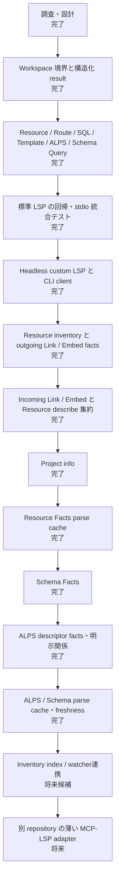

# BEAR.Sunday Semantic LSP 進捗

最終更新: 2026-09-12

この文書は、BEAR.Sunday 固有セマンティクスを Phpactor Language Server から
IDE と AI の双方へ提供する作業の現在地を示す。実装が進んだら、この図と一覧も更新する。

## 全体像

BEAR 固有の解決規則は LSP handler に置かず、transport-independent な Query 層へ
置く。LSP handler は workspace 相対パスへ正規化する薄い adapter とする。

## フェーズ別の現在地

## 現在利用できる入口

### 標準 LSP

- `textDocument/definition`: Resource URI、Route、SQL、ALPS、Template、明示 Schema
- `textDocument/typeDefinition`: Resource 規約の response Schema
- `textDocument/references`: Resource URI の参照元
- `textDocument/completion`: Resource URI と body Schema property
- `textDocument/documentLink`: Resource URI と Template 参照

### BEAR custom LSP request

- `bear/project/info`
- `bear/resource/resolve`
- `bear/resource/list`
- `bear/resource/describe`
- `bear/resource/incomingRelations`
- `bear/route/resolve`
- `bear/sql/resolve`
- `bear/template/resolve`
- `bear/template/forResource`
- `bear/alps/resolveDescriptor`
- `bear/alps/describeDescriptor`
- `bear/schema/resolveNamed`
- `bear/schema/forResource`
- `bear/schema/describeNamed`
- `bear/schema/describeForResource`

custom request は、文書内 Position を起点にできない BEAR identifier 問い合わせのための
read-only API である。標準 LSP で自然に表現できる操作の代替にはしない。

`bear/resource/describe` は、Resource class と public `on*` method、外向き・内向きの
Link/Embed、既存の Qiq/Twig template、規約で解決できる response Schema を1回の
問い合わせに集約する。内向き関係は件数上限と切り捨て状態を明示する。

`bear/alps/describeDescriptor` は、ALPS descriptor の型・表示情報と、同一profile内で
明示された親子 (`contains`)、ローカル `href`、ローカル `rt` の入出力関係を返す。
外部参照は取得せず、名前の類似からResourceとの対応を推測しない。未解決・重複した
参照先は `targetStatus` で区別できる。

ALPS profileとSchema factsの解析結果は、件数上限付きのprocess-lifetime cacheで再利用する。
各問い合わせで保存済みファイルを読みcontent hashを比較するため、mtimeとサイズが同じ編集も
即座に反映する。Resource inventoryは、watcher/indexの無効化通知なしでは追加・削除・継承変更を
正しく検出するために結局全走査が必要なので、現段階ではキャッシュしていない。

## AI からの利用

現時点でも LSP client または `tools/semantic-lsp-query.php` を使えば、IDE を起動せずに
実際の Phpactor stdio process へ問い合わせられる。MCP server はまだ作成していない。
将来の MCP adapter は、この LSP API を呼び出して schema を変換するだけの薄い層にする。
