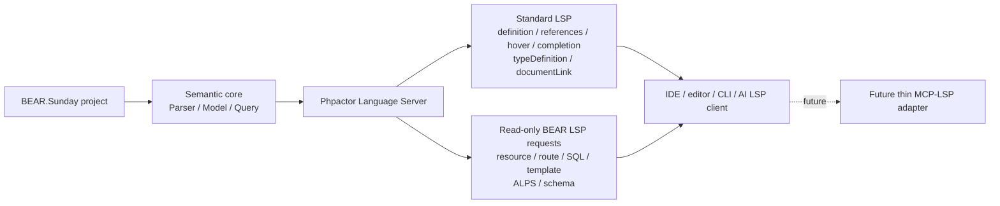
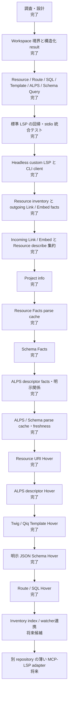

# BEAR.Sunday Semantic LSP 進捗

最終更新: 2026-09-13

この文書は、BEAR.Sunday 固有セマンティクスを Phpactor Language Server から
IDE と AI の双方へ提供する作業の現在地を示す。実装が進んだら、この図と一覧も更新する。

## 全体像

BEAR 固有の解決規則は LSP handler に置かず、transport-independent な Query 層へ
置く。LSP handler は workspace 相対パスへ正規化する薄い adapter とする。

## フェーズ別の現在地

## 現在利用できる入口

### 標準 LSP

- `textDocument/definition`: Resource URI、Route、SQL、ALPS、Template、明示 Schema
- `textDocument/typeDefinition`: Resource 規約の response Schema
- `textDocument/references`: Resource URI の参照元
- `textDocument/hover`: Resource URI の facts、Route、SQL、ALPS descriptor の fields と明示関係、静的 Template 参照、明示 JSON Schema の構造
- `textDocument/completion`: Resource URI と body Schema property
- `textDocument/documentLink`: Resource URI と Template 参照

Resource URI Hover は Phpactor の単一 Hover handler を置き換えず、その手前の middleware で
認識済み URI だけを処理する。通常の PHP symbol は既存 Phpactor Hover へ委譲するため、拡張の
読込順と Definition locator の優先順位を変更しない。妥当だが未解決の Resource URI は、PHPの
単なる文字列型へフォールバックせず空結果を返す。

ALPS descriptor Hover は `#[Alps('descriptorId')]` の第1引数だけを認識し、同じ
Query 層を通して profile、descriptor fields、同一 profile 内の明示的な `contains`・
ローカル `href`・ローカル `rt` 関係を返す。外部参照を取得せず、名前から Resource
との対応を推測しない。関係は決定的な順序で最大20件ずつ表示し、未解決または
workspace 外の参照は空結果にする。第1引数以外と通常の PHP symbol は Phpactor Hover
へ委譲する。

Template Hover は Definition と同じ静的な Twig `extends` / `include` / `include()` /
`block()` 第2引数、および Qiq `setLayout()` / `render()` / `extends()` を対象にし、engine・
元の名前・workspace相対の解決先を返す。動的式、Twig block名、コメント、文字列のクォート上は
Phpactorへ委譲し、認識済みの静的参照が未解決・不正・workspace外なら空結果にする。Hoverでの
Qiq認識は誤検知を避けるため `qiq` languageId または `var/qiq/template` 配下に限定し、既存
Definitionの互換用heuristicは変更しない。PHPとして開かれたtemplate文書ではALPS、明示Schema、
SQL、Route、Resource URI、Templateの順に判定するため、既存BEAR Hoverを抑制しない。

明示 JSON Schema Hover は BEAR の `#[JsonSchema(...)]` でファイル参照になる第1位置引数・
`schema:`・`params:` だけを認識する。前2つはresponse、`params:` はrequestとして、workspace
相対path、top-level type、名前順で最大20件のproperty・型・required状態を返す。`key:`・
`target:`・第2位置引数・動的式・別FQNの同名属性・文字列のクォート上はPhpactorへ委譲する。
raw JSONや外部`$ref`は読み出さず、認識済み参照が未解決・不正・壊れたJSON・workspace外なら
空結果にする。PHP文書ではALPS、明示Schema、SQL、Route、Resource URI、Templateの順に判定する。

Route Hover は `aura.route.php` の既知 Aura.Router 呼び出しにある静的な第1位置引数または`name:`だけを対象にし、
route名、対応するPage Resource URI・FQN・workspace相対pathを返す。HTTP pathの第2引数、`attach`、
動的式、クォート上はPhpactorへ委譲し、対応Resourceが未解決・曖昧・不正・workspace外なら空結果にする。

SQL Hover は Ray.MediaQuery の `DbQuery` 属性にある第1位置引数または `id:` と、既存のtokenized
docblock形式 `@Query("id")` の静的IDだけを対象にし、query IDとworkspace相対SQL pathを返す。
SQL本文は返さない。`type:`・`factory:`・後続引数・動的式・別FQN属性・クォート上はPhpactorへ委譲し、
認識済みIDが未解決・不正・workspace外なら空結果にする。

対応中の Phpactor には Hover provider chain がなく、拡張 middleware は標準の trace・
shutdown・cancellation middleware より前に実行される。そのため前段では構文上の認識だけを
行い、認識済み要求を内部 handler へ写して semantic query と応答を通常の lifecycle に通す。
構文認識自体は cancellation と trace 計測の外になる制約があり、Phpactor が provider chain を
公開した段階で upstream の拡張点へ移行する。

### BEAR custom LSP request

- `bear/project/info`
- `bear/resource/resolve`
- `bear/resource/list`
- `bear/resource/describe`
- `bear/resource/incomingRelations`
- `bear/route/resolve`
- `bear/sql/resolve`
- `bear/template/resolve`
- `bear/template/forResource`
- `bear/alps/resolveDescriptor`
- `bear/alps/describeDescriptor`
- `bear/schema/resolveNamed`
- `bear/schema/forResource`
- `bear/schema/describeNamed`
- `bear/schema/describeForResource`

custom request は、文書内 Position を起点にできない BEAR identifier 問い合わせのための
read-only API である。標準 LSP で自然に表現できる操作の代替にはしない。

`bear/resource/describe` は、Resource class と public `on*` method、外向き・内向きの
Link/Embed、既存の Qiq/Twig template、規約で解決できる response Schema を1回の
問い合わせに集約する。内向き関係は件数上限と切り捨て状態を明示する。

`bear/alps/describeDescriptor` は、ALPS descriptor の型・表示情報と、同一profile内で
明示された親子 (`contains`)、ローカル `href`、ローカル `rt` の入出力関係を返す。
外部参照は取得せず、名前の類似からResourceとの対応を推測しない。未解決・重複した
参照先は `targetStatus` で区別できる。

ALPS profileとSchema factsの解析結果は、件数上限付きのprocess-lifetime cacheで再利用する。
各問い合わせで保存済みファイルを読みcontent hashを比較するため、mtimeとサイズが同じ編集も
即座に反映する。Resource inventoryは、watcher/indexの無効化通知なしでは追加・削除・継承変更を
正しく検出するために結局全走査が必要なので、現段階ではキャッシュしていない。

## AI からの利用

現時点でも LSP client または `tools/semantic-lsp-query.php` を使えば、IDE を起動せずに
実際の Phpactor stdio process へ問い合わせられる。MCP server はまだ作成していない。
将来の MCP adapter は、この LSP API を呼び出して schema を変換するだけの薄い層にする。
